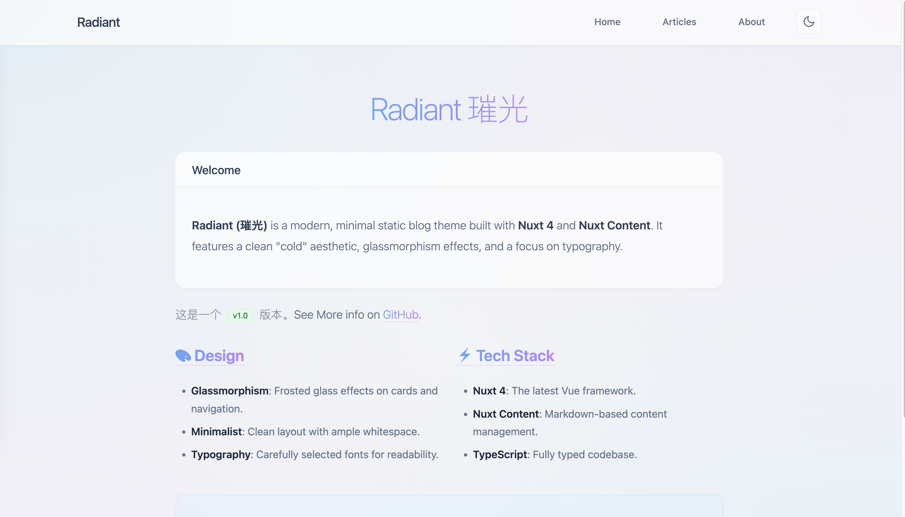

# Radiant (璀光) [](https://vercel.com/new/clone?repository-url=https://github.com/yuxbao/radiant-nuxt)


[English Documentation](./README.md)

<p align="center">
   
</p>

**Radiant (璀光)** 是一个基于 **Nuxt 4** 和 **Nuxt Content** 构建的现代极简静态博客主题。它采用了“冷淡风”美学，融合了玻璃拟态（Glassmorphism）效果，专注于排版和阅读体验。

## ✨ 特性

<p align="center">
  
</p>

- **玻璃拟态设计**：卡片和导航栏采用磨砂玻璃效果。
- **Nuxt Content v3**：强大的基于文件的内容管理系统。
- **TypeScript**：全类型支持。
- **响应式设计**：在移动端和桌面端都有完美的表现。
- **自定义组件**：内置 `::card`、`::badge`、`::grid` 和 `::alert` 等 Markdown 组件。
- **SEO 友好**：优化的 Meta 标签和结构。

## 🚀 快速开始

点击上方“Deploy”按钮，一键部署到 Vercel，或按照以下步骤在本地运行：

### 前置要求

- Node.js (v18 或更高版本)
- pnpm (推荐)

### 安装

1. 克隆仓库：

   ```bash
   git clone https://github.com/yuxbao/radiant-nuxt.git
   cd radiant-nuxt
   ```

2. 安装依赖：

   ```bash
   pnpm install
   ```

3. 启动开发服务器：
   ```bash
   pnpm dev
   ```

访问 `http://localhost:3000` 查看你的博客。

## 📝 撰写内容

在 `content/posts` 目录下创建 Markdown 文件。

```markdown
---
title: "我的第一篇文章"
description: "这是文章描述。"
date: "2024-03-22"
author: "你的名字"
tags: ["Nuxt", "Blog"]
---

# 你好，世界

在这里写下你的内容...
```

## 🎨 个性化

- **应用配置**：编辑 `nuxt.config.ts` 修改网站标题和 Meta 信息。
- **样式**：全局样式位于 `app/app.vue` 和 `app/layouts/default.vue`。

## 📄 许可证

MIT
